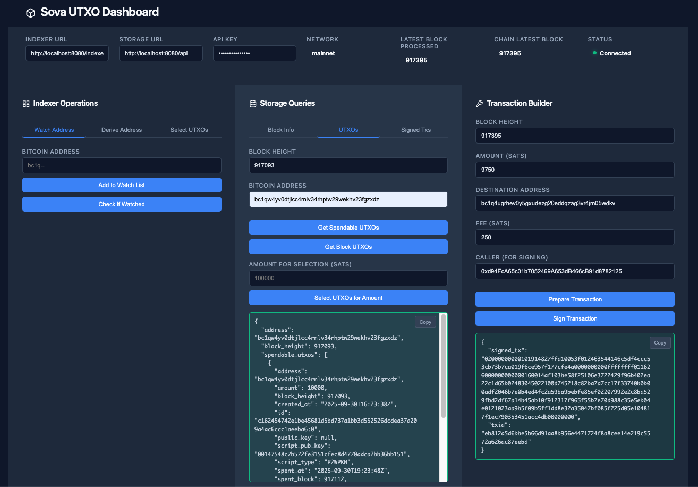

# Sova Signer Dashboard

A GUI for managing a Sova signer's Bitcoin UTXO indexer and signing service.

For more infomation about the Sova Bitcoin Indexer see the [utxo-tracing](https://github.com/SovaNetwork/utxo-tracing) repo. For more infomation on the signing service see the [network-enclave](https://github.com/SovaNetwork/network-enclave) code.



## Overview

The Sova Signer Dashboard provides a user-friendly interface for interacting with Bitcoin UTXO indexing and transaction signing services. The indexer operations section allows watching Bitcoin addresses, deriving addresses from EVM addresses, and selecting UTXOs. The storage queries section provides access to blockchain data, UTXOs, and signed transactions. The transaction builder enables preparing and signing Bitcoin transactions.

The system architecture uses four containerized services working together. The network-indexer service indexes Bitcoin UTXOs and manages watched addresses. The network-enclave service handles BIP32 key derivation and address generation. The network-utxos service stores and retrieves UTXO data. The dashboard service provides an Nginx-served web interface with CORS-enabled API proxying.

## Quick Start with Docker

### 1. Setup Environment

Copy the example environment file and configure it:

```bash
cp example.env .env
```

Edit `.env` and set your configuration values (API keys, BIP32 seed, etc.)

### 2. Choose Your Bitcoin Node Option

**Option A: Local Bitcoin Regtest Node** (for development/testing)
```bash
docker-compose --profile local-bitcoin up -d
```

**Option B: External Bitcoin RPC API** (for mainnet/testnet)
```bash
docker-compose --profile external-bitcoin up -d
```

### 3. Access the Dashboard

Open your browser to: http://localhost:8080

### Service Endpoints
- Dashboard: `http://localhost:8080`
- Indexer API: `http://localhost:3031`
- UTXO Storage API: `http://localhost:5557`
- Enclave API: `http://localhost:5555`
- Bitcoin RPC (local): `http://localhost:18443`

## Configuration

Key environment variables (see `example.env` for full details):

- `BITCOIN_NETWORK`: Network type (regtest, testnet, mainnet)
- `INDEXER_SHARED_API_KEY`: API key for indexer authentication
- `ENCLAVE_BIP32_SEED`: Seed for key derivation (keep secure!)
- `WATCHLIST_SEED`: Comma-separated Bitcoin addresses to watch on startup

## Usage

Configure the Indexer URL, Storage URL, and API Key in the top configuration bar before using the dashboard features.

The dashboard provides three main sections:

1. **Indexer Operations**: Add addresses to watchlist, derive Bitcoin addresses from EVM addresses, select UTXOs
2. **Storage Queries**: Query latest blocks, transaction IDs, spendable UTXOs, and signed transactions
3. **Transaction Builder**: Create and sign Bitcoin transactions
